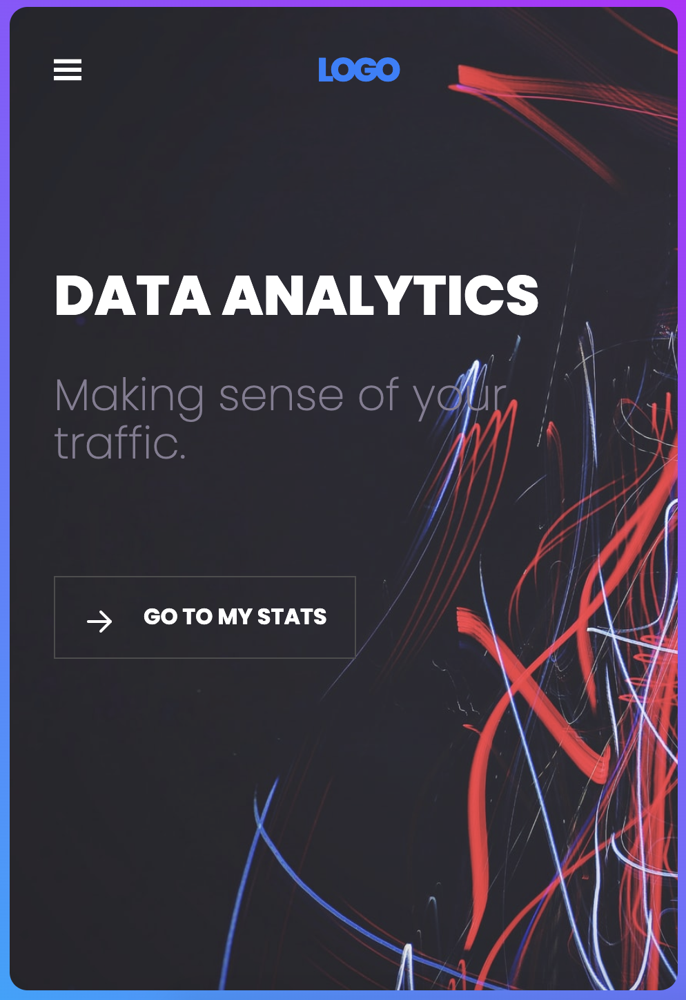
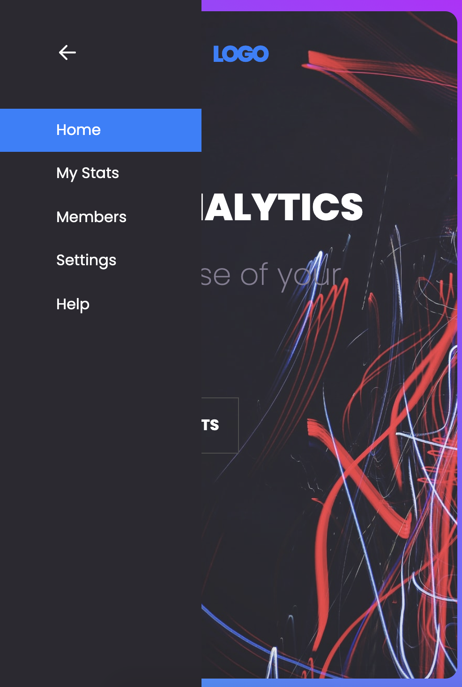

# Data Analytics Dashboard

This is a project from [Scrimba's From Figma to code](https://scrimba.com/learn/figmatocode), taught by Gary Simon.

## Table of contents

- [Overview](#overview)
  - [Screenshots](#screenshots)
  - [Links](#links)
- [My process](#my-process)
  - [Built with](#built-with)
- [Author](#author)

## Overview

### Screenshots

### Links

- [Live Site URL](https://miri52.github.io/data-analytics-dashboard/)

## My process

### Built with

- Mobile-first workflow
- Media queries
- Flexbox

## Author

- LinkedIn - [Miriama Svítková](https://www.linkedin.com/in/miriama-svitkova)
